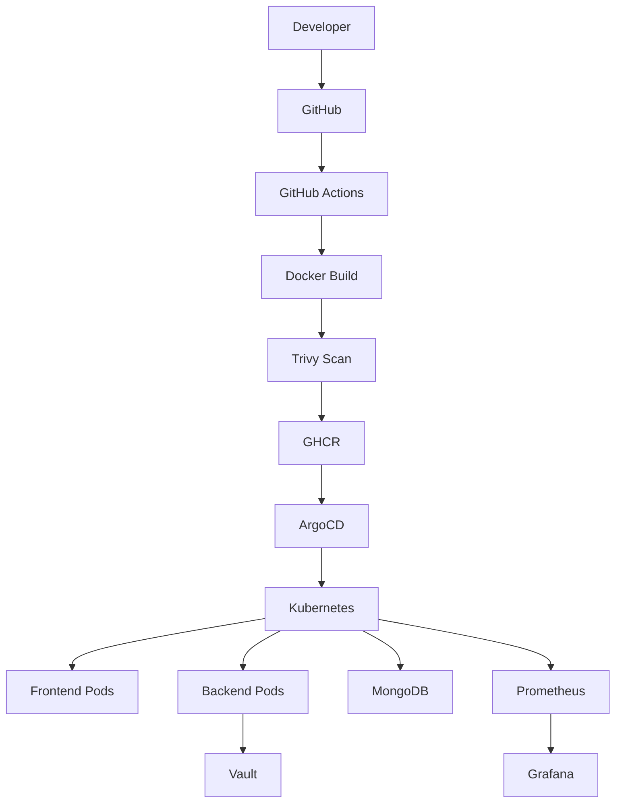

<div align="center">

# 🚀 DevSecOps Employee Portal

### Enterprise Grade DevSecOps + GitOps Platform


<br>


</div>

---

# 🌟 Project Overview

DevSecOps Employee Portal is a production-grade Employee Management System designed to demonstrate a complete modern software delivery lifecycle.

The platform implements:

* Secure CI/CD pipelines
* Containerization
* Vulnerability scanning
* GitOps deployment
* Kubernetes orchestration
* Secrets management
* Infrastructure monitoring
* Application observability

---

# 🎬 Project Flow

```text
Developer Push
      │
      ▼
GitHub Repository
      │
      ▼
GitHub Actions
      │
      ▼
Docker Build
      │
      ▼
Trivy Security Scan
      │
      ▼
GHCR Registry
      │
      ▼
ArgoCD GitOps
      │
      ▼
Kubernetes Cluster
      │
 ┌────┼────┐
 ▼    ▼    ▼
Frontend Backend MongoDB
      │
      ▼
HashiCorp Vault
      │
      ▼
Prometheus
      │
      ▼
Grafana
```

---

# 🏗️ Architecture Diagram



---

# ⚡ Features

## Employee Management

* Employee CRUD Operations
* Search & Filtering
* Role-Based Access Control
* Profile Management
* Attendance Analytics

## Security

* JWT Authentication
* Password Hashing
* Helmet Security Headers
* Rate Limiting
* Trivy Vulnerability Scanning
* HashiCorp Vault Integration

## DevOps

* Dockerized Services
* GitHub Actions CI/CD
* GHCR Registry
* Kubernetes Deployments
* GitOps with ArgoCD

## Monitoring

* Prometheus Metrics
* Grafana Dashboards
* Infrastructure Monitoring
* Application Monitoring

---

# 🐳 Docker Implementation

<details>
<summary>View Docker Workflow</summary>

```text
Backend Source
      │
      ▼
Dockerfile
      │
      ▼
Docker Image
      │
      ▼
GHCR Registry
      │
      ▼
Kubernetes Deployment
```

</details>

---

# ⚙️ CI/CD Pipeline

```yaml
Push
  ↓
Checkout
  ↓
Install Dependencies
  ↓
Run Tests
  ↓
Build Images
  ↓
Trivy Scan
  ↓
Push GHCR
```

---

# ☸️ Kubernetes Deployment

## Namespace

```yaml
employee-portal
```

## Services

* Frontend Service
* Backend Service
* MongoDB Service

## Deployments

* Frontend Deployment
* Backend Deployment
* MongoDB Deployment

---

# 🔄 GitOps Workflow

```text
Developer
   │
git push
   │
   ▼
GitHub
   │
   ▼
ArgoCD
   │
Auto Sync
   │
   ▼
Kubernetes
```

### Features

✅ Auto Sync

✅ Self Heal

✅ Drift Detection

✅ Automated Rollback

---

# 🔐 HashiCorp Vault

Secrets stored securely:

```text
MONGODB_URI
JWT_SECRET
API_KEYS
```

Benefits:

* No hardcoded credentials
* Centralized secret management
* Secure secret rotation

---

# 📈 Prometheus Metrics

Collected Metrics:

```text
CPU Usage
Memory Usage
Pod Health
Network Usage
Node Metrics
Custom Backend Metrics
```

Custom Metrics:

```text
employee_portal_http_requests_total

employee_portal_http_request_duration_seconds
```

---

# 📊 Grafana Dashboards

### Kubernetes Monitoring

* Cluster Health
* Resource Utilization
* Pod Status

### Infrastructure Monitoring

* CPU
* Memory
* Disk Usage
* Network Traffic

### Application Monitoring

* Request Count
* Response Time
* Error Rate

---

# 📂 Repository Structure

```text
DevSecOps-Employee-Portal
│
├── Frontend
├── BackEnd
├── k8s
├── .github/workflows
├── Dockerfiles
├── Vault
├── Monitoring
└── README.md
```

---

# 🚀 Deployment Guide

## Clone Repository

```bash
git clone https://github.com/RATHAN005/DevSecOps-Employee-Portal.git
```

## Run Docker

```bash
docker compose up -d
```

## Deploy Kubernetes

```bash
kubectl apply -f k8s/
```

## Verify

```bash
kubectl get pods -n employee-portal
```

---

# 📸 Project Screenshots

### Employee Dashboard

(Add Screenshot)

### GitHub Actions Pipeline

(Add Screenshot)

### ArgoCD Application

(Add Screenshot)

### Grafana Dashboard

(Add Screenshot)

### Kubernetes Pods

(Add Screenshot)

---

# 🏆 Achievements

✅ End-to-End DevSecOps Platform

✅ GitOps Deployment Strategy

✅ Enterprise Security Practices

✅ Kubernetes Orchestration

✅ Secrets Management

✅ Monitoring & Observability

✅ Production Ready CI/CD

---

<div align="center">

### ⭐ If you like this project, consider giving it a star!

Built with ❤️ by Rathan K

</div>
